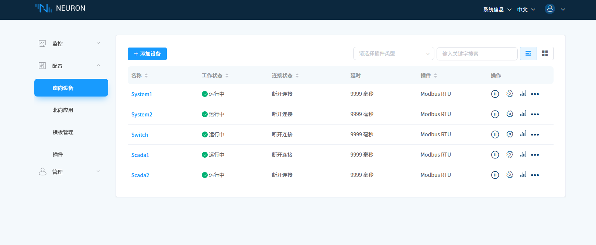
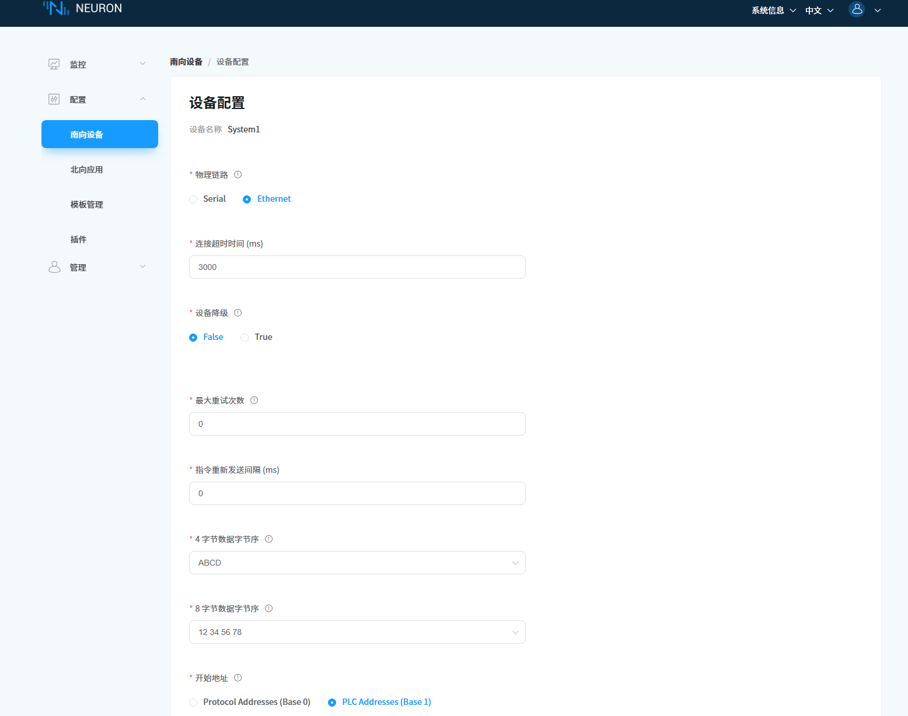

# 设置流程

## 1. 构建网络

- 设置路由器DHCP模式
- 设置路由器IP地址 192.168.1.1
- 将主机插入路由器
- 等待主机获取IP后 网线灯亮起

## 2. 扫描网络

- 打开路由器设置 获取主机IP地址
- 使用另一台电脑 连接路由器 通过ssh工具 访问主机

> ssh 工具使用教程
> putty下载、安装和使用教程（保姆级，图文并茂）：putty中文版远程管理工具详解
> https://developer.aliyun.com/article/1716842

## 3. 进入控制系统调试台

- 使用另一台电脑 访问地址 IP:7000 进入Neuron控制台
- 使用上一步的ssh工具 登录主机的命令行界面

> neuron 控制台
> 账号 admin
> 密码 0000
------
> 主机
> 账号 nucdamin
> 密码 a123456789

## 4. 配置系统连接

- 插入系统1 usb线 连接主机
- 在命令行输入 dmesg | grep tty 查看插入的usb串口设备名称
- 以此类推 完成所有4路总线的串口对应

## 5. 在Neuron控制台配置系统连接

> 参考文档 https://docs.emqx.com/zh/neuronex/latest/

- 在南向设备选择对应系统
- 电机设置按钮 进去配置界面

- 修改物理链路为 Serial
- 串口设备栏输入 /dev/串口名称 这里对应总步骤4
- 点击提交
- 四个系统以此类推

> Scada 我也不知道能不能公用连接设置一个串口 如果不行 就得再添置一个Serial-USB转换器

## 6. 系统调试

- 进入数据监控 选择对应设备组 进行系统调试
- 如果设备不上数 就是设置或者接线有问题
- 也可以发送测试指令 看是否能正常响应
